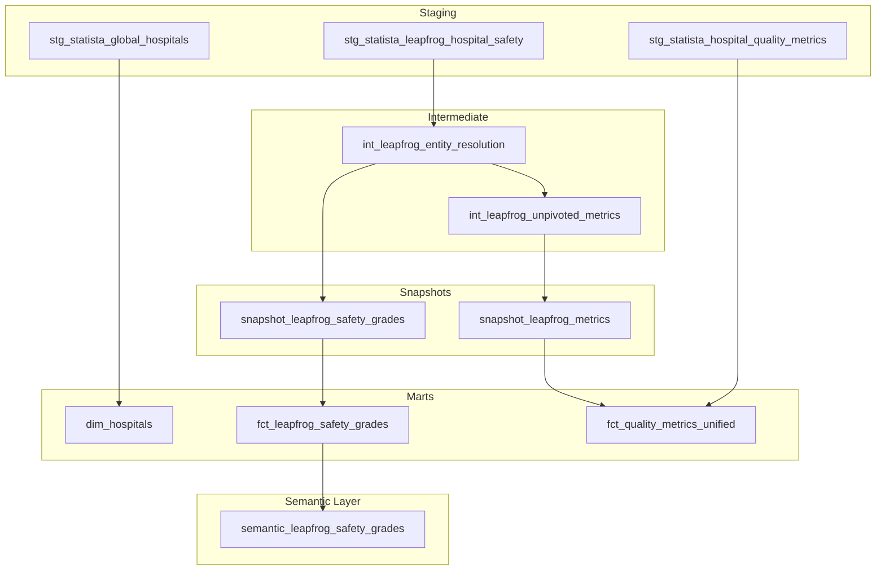
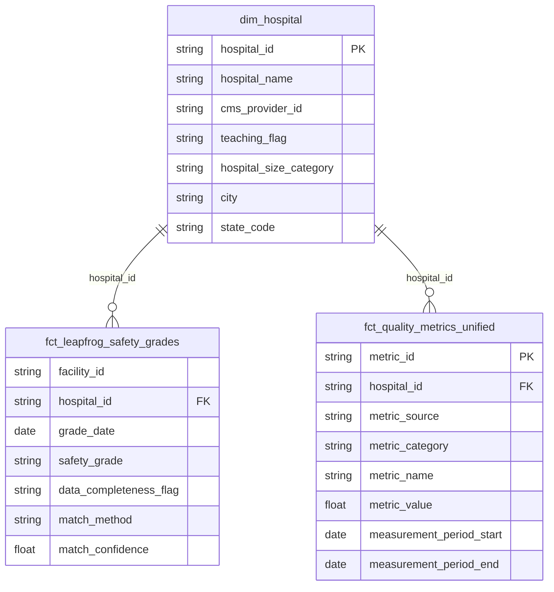

# Healthcare Domain – Analytics Engineering Package

## Domain Purpose
The healthcare domain contains all data models, tests, and documentation required to model healthcare-related entities and metrics within the Statista Analytics Platform.

This domain is implemented as a **self-contained dbt package** and is designed for:
- Isolation from other business domains (product, finance, growth)
- Independent deployment and failure containment
- External consumption via marts and BI tools without cross-domain dependencies

No model inside this domain references models from other domains directly.

---

## Domain Scope
This package currently covers:
- Hospital master data
- Patient safety and quality metrics
- Leapfrog hospital safety grades
- Entity resolution between vendor facilities and internal hospitals
- Longitudinal, audit-ready metric storage

Future healthcare vendors can be onboarded without changing existing marts.

---

## Directory Structure
```
healthcare/
├── models/
│   ├── staging/
│   │   ├── stg_hospitals.sql
│   │   ├── stg_hospital_quality_metrics.sql
│   │   └── stg_leapfrog__hospital_safety.sql
│   │
│   ├── intermediate/
│   │   ├
│   │   ├── int_leapfrog__entity_resolution.sql
│   │   ├
│   │   └── int_leapfrog_unpivoted_metrics.sql
│   │
│   ├── marts/
│   │   ├── dim_hospital.sql
│   │   ├── fct_leapfrog_safety_grades.sql
│   │   |
│   │   └── fct_quality_metrics_unified.sql
│
├── snapshots/
│   ├── snap_leapfrog_safety_grades.sql
│   └── snap_leapfrog_metrics.sql
│
├── tests/
│   └── singular/
│
└── schema.yml
```

---

## DAG


---
## ER Diagram

---
## Layer Responsibilities

### Staging
- Minimal transformations
- Type casting and renaming
- No joins or business logic
- Mirrors raw vendor semantics

### Intermediate
- Entity resolution logic
- Conservative matching policies
- Metric normalization
- Data quality evaluation
- Business rules applied once and reused downstream

### Snapshots
- SCD2 tracking of vendor-published values
- First-seen record preservation
- Supports audit and reproducibility requirements

### Marts
- Analytics-ready tables
- One hospital, many metrics
- Stable schemas for BI tools and downstream consumers

---

## Entity Resolution Policy
Leapfrog facilities are resolved to internal hospitals using a deterministic priority order:

1. CMS Provider ID (CCN) strict match
2. Fuzzy hospital name match with exact city and state
3. Unmatched

Each record produces:
- hospital_id
- match_method
- match_confidence
- resolution_status

False positives are explicitly avoided, even at the cost of coverage.

---

## Key Identifiers

### CMS Provider ID (CCN)
- Government-assigned identifier for Medicare-certified facilities
- Stable across time
- Primary join key for entity resolution


---

## Audit & Reproducibility
- All Leapfrog grades and metrics are snapshotted
- Historical corrections do not overwrite published values
- Rankings can be reproduced for any past publication window

---

## Testing Strategy

### Generic Tests
- not_null on primary keys
- unique on grain-defining columns
- accepted_values on enumerations

### Singular Tests
- One row per facility_id and grade_date in entity resolution
- No fuzzy matches when CCN exists
- Match confidence aligns with match method
- Data completeness flags are valid

---

## Performance & Cost Controls
- Views used in staging and intermediate layers
- Incremental snapshots limit recomputation
- Fuzzy matching executed only when CCN is missing

---

## External Consumption
This domain exposes only marts for external usage:
- dim_hospital
- fct_leapfrog_safety_grades
- fct_quality_metrics_unified

Other domains and BI tools must consume only these outputs.

---

## Assumptions
- Hospitals change metadata slowly
- Leapfrog republishes historical data
- Conservative matching is preferred over completeness
- Additional vendors will conform to the unified metric schema

---

## Ownership
Owned by Analytics Engineering.
Changes require schema documentation and test coverage.
